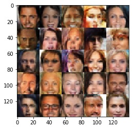

# Face-Generation
DLND project: Face generation by deep convolutional generative adversarial network.



# Usage
```
git clone https://github.com/Meirtz/Face-Generation.git
cd ./Face-Generation
jupyter notebook dlnd_face_generation.ipynb
```

# Prerequisites
**tensorflow** 1.0 or above

**jupyter**

# Acknowledgement
This is a project of Udacity DLND(Deep Learning NanoDegree program).

